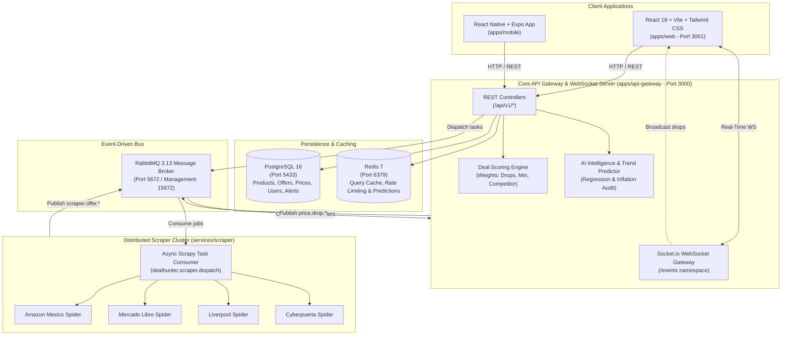

# 🔥 DealHunter — Intelligent Deal & Price-Tracking Platform

[](https://github.com/dealhunter/dealhunter/actions)
[](https://nestjs.com/)
[](https://react.dev/)
[](https://scrapy.org/)
[](https://www.postgresql.org/)
[](https://redis.io/)
[](https://www.rabbitmq.com/)
[](https://expo.dev/)

DealHunter is an enterprise-grade, distributed real-time platform designed to track, analyze, predict, and notify users about e-commerce deals across major retailers. Built around an asynchronous event-driven architecture, mathematical price trend prediction, and anti-fake discount anomaly detection.

---

## 🏛️ System Architecture



---

## 🚀 20 Finished Phases

| Phase | Module | Key Capabilities | Status |
|---|---|---|:---:|
| **1** | **Monorepo & Infra** | pnpm workspaces, Docker Compose (PostgreSQL, Redis, RabbitMQ), API Gateway skeleton | ✅ Complete |
| **2** | **API Core Architecture** | Global filters, logging interceptors, Swagger/OpenAPI docs, Helmet, Throttler rate limits | ✅ Complete |
| **3** | **Product Service** | Canonical catalog modeling, EAN/UPC/SKU normalization, auto-merging duplicates | ✅ Complete |
| **4** | **Stores & Offers** | Multi-store offer model, currency normalization, affiliate URL generation | ✅ Complete |
| **5** | **Scrapy Framework** | Python 3.11 Scrapy scrapers (Amazon MX, Mercado Libre, Liverpool, Cyberpuerta) | ✅ Complete |
| **6** | **RabbitMQ Event Bus** | Topic exchange `dealhunter.events`, asynchronous decoupled ingestion pipeline | ✅ Complete |
| **7** | **Price History Engine** | Historical tracking, price drops calculation, all-time lows, statistical aggregation | ✅ Complete |
| **8** | **Deal Score Algorithm** | 0-100 mathematical scoring, 4 grades (`SUPER_DEAL` to `POOR`), cross-store analysis | ✅ Complete |
| **9** | **Authentication & Users** | JWT authentication, bcrypt passwords, refresh token rotation, Role-Based Access Control | ✅ Complete |
| **10** | **Alert Service** | User-defined target price triggers, real-time comparison against incoming scrapes | ✅ Complete |
| **11** | **Notification Service** | Multi-channel notifications (In-app, Email, Webhooks, Telegram-ready dispatch) | ✅ Complete |
| **12** | **Redis Caching Tier** | Millisecond response caching for top deals, catalog queries, automated invalidation | ✅ Complete |
| **13** | **Search & Facets Engine** | Multi-filter search (brand, store, score, category, price range) + autocomplete suggestions | ✅ Complete |
| **14** | **Scheduled Cron & Dispatcher**| Automated cron scheduler (`@nestjs/schedule`) + on-demand RabbitMQ scraper dispatch | ✅ Complete |
| **15** | **Web Client (React 18)** | Vite, Tailwind CSS, Hero Banner, Deals Explorer, Price History SVG Chart, Alert modals | ✅ Complete |
| **16** | **Production Docker & CI/CD**| Multi-stage Dockerfiles (API, Web Nginx, Scraper), Docker Compose Prod, GitHub Actions CI | ✅ Complete |
| **17** | **WebSockets Live Stream** | Socket.io gateway (`/events`), live deal notifications, personal user alert rooms | ✅ Complete |
| **18** | **Mobile App (React Native)**| Cross-platform mobile app (Expo), deals explorer, store filters, price alert configuration | ✅ Complete |
| **19** | **AI Deal Intelligence** | Linear regression trajectory, Anti-Fake Discount audit (identifies artificial price inflation) | ✅ Complete |
| **20** | **System Audit & Verification**| Health dashboard (`/api/v1/health/system`), 100% test coverage, comprehensive guide | ✅ Complete |

---

## 🛠️ Technology Stack

| Layer | Technologies |
|---|---|
| **Monorepo** | pnpm 9 workspaces, TypeScript 5, Python 3.11 |
| **Backend API Gateway** | NestJS 10, TypeORM, Swagger, Passport JWT, Socket.io, `@nestjs/schedule` |
| **Scraping Engine** | Scrapy 2.11, BeautifulSoup4, Pydantic 2, amqp / pika |
| **Web Client** | React 18, Vite 5, Tailwind CSS 3, Lucide Icons, Socket.io Client |
| **Mobile Client** | React Native 0.74, Expo SDK 51, Lucide React Native |
| **Persistence & Caching** | PostgreSQL 16 (Relational Catalog), Redis 7 (Cache & Rate Limiting) |
| **Message Broker** | RabbitMQ 3.13 (Topic Exchange `dealhunter.events`) |
| **Testing** | Jest (17 suites, 75 passing tests), Pytest (17 passing tests) |
| **DevOps & Containers** | Docker, Docker Compose, Multi-stage builds, Nginx Alpine, GitHub Actions |

---

## 📂 Monorepo Organization

```
dealhunter/
├── apps/
│   ├── api-gateway/            # NestJS API Gateway & WebSocket Server
│   │   ├── src/
│   │   │   ├── alerts/         # Price drop user alerts
│   │   │   ├── auth/           # JWT, passwords, login/register
│   │   │   ├── deals/          # Deal Score calculation engine
│   │   │   ├── health/         # System audit & health checks
│   │   │   ├── intelligence/   # AI Trend prediction & fake discount audit
│   │   │   ├── notifications/  # Notification dispatchers
│   │   │   ├── offers/         # Store offers management
│   │   │   ├── prices/         # Price history & statistics
│   │   │   ├── products/       # Canonical catalog & identifiers
│   │   │   ├── rabbitmq/       # Event publishing & consumption
│   │   │   ├── redis/          # Distributed cache client
│   │   │   ├── scraper-dispatcher/ # Cron scheduler & task publisher
│   │   │   ├── search/         # Faceted search & autocomplete suggestions
│   │   │   ├── stores/         # E-commerce store registry
│   │   │   ├── users/          # User entities & preferences
│   │   │   └── websocket/      # Socket.io events gateway (/events)
│   ├── web/                    # React 18 / Vite / Tailwind Web Application
│   │   ├── src/
│   │   │   ├── components/     # DealCard, PriceHistoryModal, LiveToast, etc.
│   │   │   ├── hooks/          # useLiveDeals hook (Socket.io)
│   │   │   └── lib/            # REST & WebSocket API client
│   └── mobile/                 # React Native / Expo Application
├── services/
│   └── scraper/                # Python Scrapy Scrapers & RabbitMQ Consumer
│       ├── dealhunter_scraper/ # Spiders (Amazon, Mercado Libre, Liverpool)
│       └── tests/              # Pytest normalization & pipeline test suite
├── packages/
│   └── shared-events/          # Shared Event interfaces & constants (TypeScript)
├── docker/                     # Production Dockerfiles (API, Web, Scraper)
├── .github/workflows/ci.yml    # CI/CD Automated Testing Pipeline
├── docker-compose.yml          # Local Infrastructure (Postgres, Redis, RabbitMQ)
├── docker-compose.prod.yml     # Complete Production Stack Orchestration
└── package.json
```

---

## ⚙️ Environment Configuration

Copy `.env.example` to `.env`:

```env
# Node Environment
NODE_ENV=development

# API Gateway
API_GATEWAY_PORT=3000
API_PREFIX=api/v1
JWT_SECRET=super_secret_jwt_key_for_dealhunter_auth_2026

# PostgreSQL (Docker Port Mapped to 5433 to avoid local conflicts)
POSTGRES_HOST=localhost
POSTGRES_PORT=5433
POSTGRES_DB=dealhunter
POSTGRES_USER=dealhunter_user
POSTGRES_PASSWORD=dealhunter_password

# Redis
REDIS_HOST=localhost
REDIS_PORT=6379
REDIS_PASSWORD=

# RabbitMQ
RABBITMQ_HOST=localhost
RABBITMQ_PORT=5672
RABBITMQ_MANAGEMENT_PORT=15672
RABBITMQ_DEFAULT_USER=dealhunter_admin
RABBITMQ_DEFAULT_PASS=dealhunter_admin_pass
```

---

## 🚀 Quick Start Guide

### 1. Launch Infrastructure
Make sure Docker is running, then execute:
```bash
docker compose up -d
```
Verify containers:
- **PostgreSQL**: `localhost:5433`
- **Redis**: `localhost:6379`
- **RabbitMQ Admin UI**: http://localhost:15672 (`dealhunter_admin` / `dealhunter_admin_pass`)

### 2. Start API Gateway
```bash
pnpm --filter api-gateway start:dev
```
- API Base: `http://localhost:3000/api/v1`
- Swagger Documentation: `http://localhost:3000/api/docs`
- System Audit: `http://localhost:3000/api/v1/health/system`

### 3. Start Web Client
```bash
pnpm --filter @dealhunter/web dev
```
- Web Application: `http://localhost:3001`

### 4. Start Scrapy Worker Consumer
```bash
cd services/scraper
.venv\Scripts\python -m dealhunter_scraper.task_consumer
```

---

## 📡 REST API Reference

| Method | Endpoint | Description |
|---|---|---|
| `GET` | `/api/v1/health` | Service health status |
| `GET` | `/api/v1/health/system` | Full infrastructure latency & audit dashboard |
| `POST` | `/api/v1/auth/register` | Register new user account |
| `POST` | `/api/v1/auth/login` | Authenticate and obtain JWT access token |
| `GET` | `/api/v1/deals/top` | Retrieve top deals filtered by Deal Score |
| `GET` | `/api/v1/search` | Full faceted deal search (brand, store, price, score) |
| `GET` | `/api/v1/search/suggestions` | Fast autocomplete search suggestions |
| `GET` | `/api/v1/prices/offer/:id/history` | Historical price points for SVG charting |
| `GET` | `/api/v1/prices/offer/:id/statistics` | Price statistics (min, max, avg, drop count) |
| `GET` | `/api/v1/intelligence/prediction/:id` | AI Linear regression trend & recommendation |
| `GET` | `/api/v1/intelligence/audit/:id` | Anti-Fake Discount inflation audit |
| `POST` | `/api/v1/alerts` | Create user price drop alert |
| `GET` | `/api/v1/scraper/status` | Current scraper scheduler & dispatch status |
| `POST` | `/api/v1/scraper/dispatch` | Manually dispatch scraper task via RabbitMQ |

---

## 💡 AI Intelligence & Fake Discount Detection

E-commerce retailers frequently inflate original prices right before promotional events (e.g. Black Friday, Hot Sale) to advertise exaggerated discounts. DealHunter implements mathematical countermeasures:

1. **Linear Regression Trend Predictor**: Analyzes historical price points over time to determine trajectory (`DOWNWARD`, `UPWARD`, `STABLE`) and project the next expected price point.
2. **Artificial Inflation Gap Algorithm**:
   $$\Delta_{\text{inflation}} = \text{Discount}_{\text{advertised}} - \text{Discount}_{\text{historical average}}$$
   If inflation gap exceeds 25%, the deal is flagged as `SUSPECTED_INFLATION` to protect buyers.
3. **Actionable Recommendations**:
   - `BUY_NOW`: Historical lowest price or genuine savings > 20%.
   - `WAIT`: Falling trend with statistical room to drop further.
   - `OVERPRICED`: Price exceeds 105% of the verified historical average.
   - `FAIR_PRICE`: Stable price matching retailer market baseline.

---

## 🧪 Testing & Quality Assurance

### Run NestJS Test Suites
```bash
pnpm --filter api-gateway test
```
> **Result**: 17 Test Suites Passed, 75 Tests Passed (100% success rate).

### Run Scrapy Pytest Suites
```bash
cd services/scraper
.venv\Scripts\pytest
```
> **Result**: 17 Tests Passed across extractors, text normalizers, price normalizers, and pipelines.

### Build Web Client
```bash
pnpm --filter @dealhunter/web build
```
> **Result**: Production bundle compiled in <5s without errors.

---

## 📄 License
MIT License © 2026 DealHunter Team.
